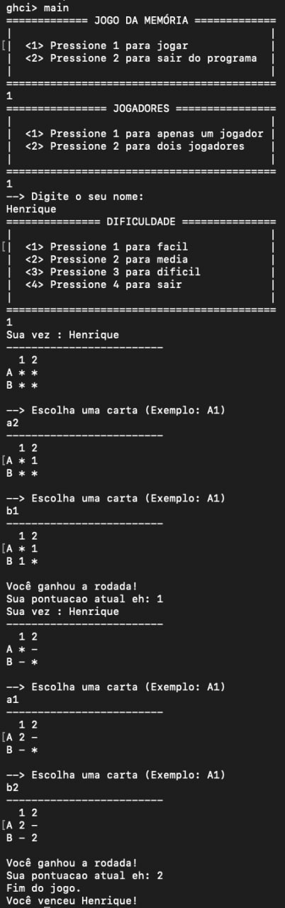
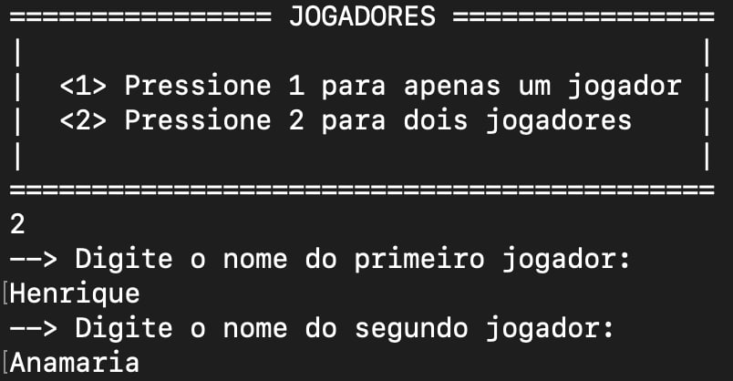
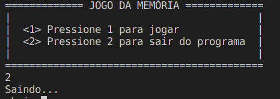
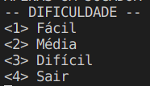
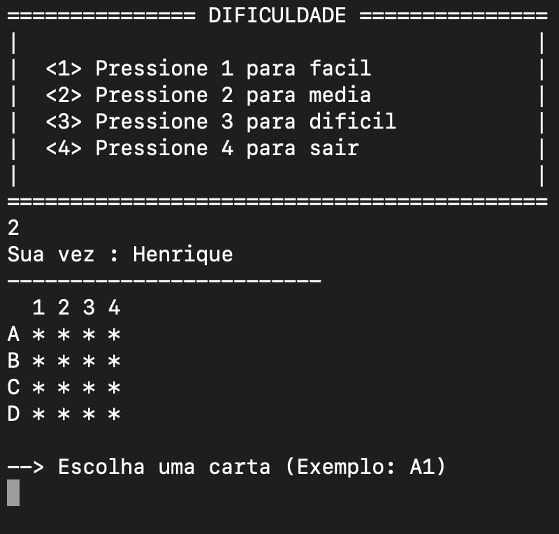
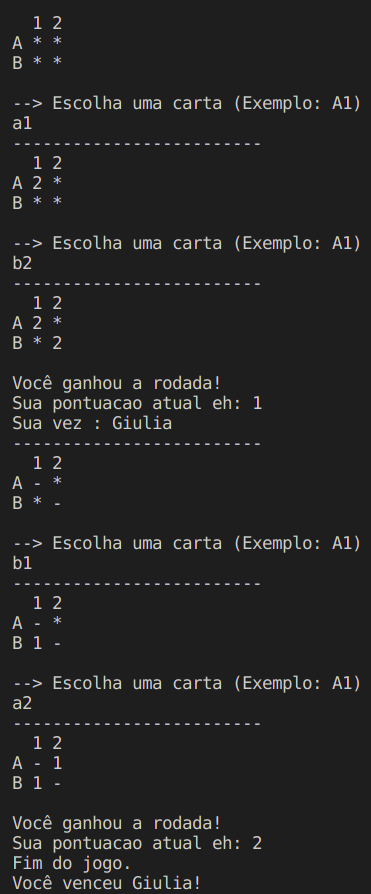

# 2022.1_G2_Funcional_ProjetoMemoria
# Projeto Memória

**Disciplina**: FGA0210 - PARADIGMAS DE PROGRAMAÇÃO - T01 <br>
**Nro do Grupo**: 02<br>
**Paradigma**: Funcional<br>

## Alunos
| Matrícula | Aluno                                                               |
| --------- | ------------------------------------------------------------------- |
| 180119818 | [Felipe Boccardi Silva Agustini](http://github.com/fealps)          |
| 180052845 | [Gabriela da Gama Pivetta](http://github.com/gabrielapivetta)       |
| 180017659 | [Giovana Vitor Dionisio Santana](http://github.com/giovanadionisio) |
| 170011267 | [Giovanna Borges Bottino](http://github.com/giovannabbottino)       |
| 180017870 | [Giulia Lobo Barros](http://github.com/Giuulob89)                   |
| 170144488 | [Henrique Amorim Costa Melo](http://github.com/henriqueamorim20)    |
| 180018574 | [Hérya Rodrigues Alcantara](http://github.com/hryds)                |
| 180025601 | [Murilo Gomes de Souza](http://github.com/murilogds)                |

## Sobre 
Jogo da memória desenvolvido com Haskell e aplicando o paradigma funcional. Possui Funções puras, Imutabilidade, Transparência referencial e Funções de alta ordem como  filter, map e reduce.

## Screenshots
<figure>
  
  <figcaption>Menu</figcaption>
</figure><br><br>
<figure>
  
  <figcaption>Fim do Jogo</figcaption>
</figure>

## Instalação 
**Linguagens**: Haskell<br>
**Tecnologias**: Haskell, Random, Stack e GHC<br>
> Link para instalação do stack: https://docs.haskellstack.org/en/stable/install_and_upgrade/

Para rodar o Projeto do Jogo da Memória, é necessário seguir os passos abaixo:

1. Entrar na pasta correspodente ao repositório
```sh
cd 2022.1_G2_Funcional_ProjetoMemoria/src
```
2. Instalar o random
```sh
stack install random
```
3. Iniciar o GHC com o stack
```sh
stack ghci
```
4. Compilar
```sh
:load Main
```
5. Rodar Jogo
```sh
main
```

## Uso 
1. Depois que o projeto começar a rodar, irá aparecer o menu indicando as instruções para iniciar o jogo:<br><br>
<figure>
  
  <figcaption>Menu</figcaption>
</figure><br><br>
2. É possível escolher a opção **1**, a qual iniciará o jogo e mostrará novas instruções para identificação do jogador (Após o primeiro jogador ser identificado é possível inserir mais um jogador no jogo, porém essa é uma ação opcional) ou a opção **2**, a qual irá finalizar a aplicação:<br><br>
<figure>
  
  <figcaption>Número e identificação de jogadores</figcaption>
</figure><br><br>
<figure>
  
  <figcaption>Saída</figcaption>
</figure><br><br>
3. Depois que todos os jogadores são identificados, são mostrados os níveis de dificuldade do jogo (Neste momento também é possível sair do jogo):<br><br>
<figure>
  
  <figcaption>Dificuldades</figcaption>
</figure><br><br>
4. Após escolher um nível de dificuldade, o jogo de fato começa. O tabuleiro é representado por linhas de letras e colunas de números e cada carta (representada por um ' * ' ) é localizada pelo par de uma letra com um número (e.g. A1, B2, B4). Em cada rodada (de cada jogador), o jogador escolhe duas cartas e pode ver seus valores. Quando elas são iguais, a pontuação do jogador aumenta em +1 e as cartas viram novamente, mas trocando seu carácter de ' * ' para ' _ '. Caso contrário, o tabuleiro volta a apresentar o carácter ' * ' no lugar das cartas escolhidas e a pontuação não muda:<br><br>
<figure>
  
  <figcaption>Primeira Rodada (Tabuleiro Original sem nenhum acerto)</figcaption>
</figure><br><br>
<figure>
  
  <figcaption>Rodada com e sem acertos</figcaption>
</figure><br><br>
5. Ao final do jogo, são mostradas informações como o número de pontos feitos pelo jogador vencedor e o nome dele:<br><br>
<figure>
  
  <figcaption>Fim do Jogo</figcaption>
</figure><br><br>

**Gif do fluxo completo:**<br>


## Vídeo
[Apresentação - Jogo da Memória](./src/imagens/Apresenta%C3%A7%C3%A3o%20Paradigmas-20220703_215938-Meeting%20Recording.mp4) (Fazer o download)

## Participações
Apresente, brevemente, como cada membro do grupo contribuiu para o projeto.

| Aluno | Contribuição | Significância da Contribuição para o Projeto (Excelente/Boa/Regular/Ruim/Nula) |
| ----- | ------------ | ------------------------------------------------------------------------------ |
| Felipe | Programação das Cartas, Tabuleiro e Finalização do trabalho    |  Excelente |
| Gabriela | Programação da Pontuação, ajustes e Finalização do trabalho | Excelente|
| Giovana | Programação dos Jogadores e Finalização do trabalho | Excelente |
| Giovanna | Programação das Cartas, Tabuleiro e Finalização do trabalho    |  Excelente |
| Giulia | Programação das Dificuldades e Finalização do trabalho   |  Excelente  |
| Hérya | Programação dos Jogadores e Finalização do trabalho   |  Excelente  |
| Henrique | Programação da Pontuação, ajustes e Finalização do trabalho | Excelente |
| Murilo | Programação das Dificuldades e Finalização do trabalho   |  Excelente  |

## Outros 
### I. Lições Aprendidas
- Usar system.random
- Recursão
- Tratar todas as possíveis entradas com guarded ou if e else
- Linguagem Haskell

### II. Percepções
Uma das maiores percepções obtidas pela equipe ao longo da execução deste trabalho foi a modularização possibilitada pelo Paradigma Funcional, principalmente pelo Haskell. Todo o trabalho foi divido em módulos que compõem o jogo da memória. Estes módulos puderam ser trabalhados em paralelo para depois serem amarrados a fim de termos um jogo em plena funcionalidade. 

### III. Contribuições e Fragilidades
Para a elaboração deste trabalho, a equipe utilizou somente uma biblioteca externa e nenhum código de terceiros. Desta forma, o jogo implementado é, quase que integralmente, resultado do trabalho dos membros. Assim, é possível perceber um trabaho com lógica própria, baseado nos conhecimentos que a equipe obteve ao longo deste módulo da disciplina.  

Entretanto, ainda são notadas algumas fragilidades no projeto. A primeira delas, e que pode ser considerada como um possível trabalho posterior, é o tratamento das exceções. Ao receber dados diferentes do que é esperado pelo jogo, o programa quebra. Utilizando mecanismos para tratamentos de erros, é possível eliminar esta fragilidade. Outra fragilidade, que afeta a jogabilidade do projeto, é o fato do terminal mostrar os resultados das rodadas ao longo da execução do jogo. Desta forma, é possível que os jogadores burlem o propósito do jogo da memória, que é justamente memorizar as cartas. 

### IV. Trabalhos Futuros
A equipe elenca duas notáveis possibilidades de futuros trabalhos em cima do atual jogo:
  * Implementação de interface gráfica, tornando o jogo mais lúdico e de fácil utilização;
  * Possiblitar partidas com mais de dois jogadores, aumentando o nível de entretenimento do jogo.  
  
Além disso, a correção das fragilidades elencadas no tópico anterior também configuram possíveis trabalhos futuros para este projeto. 

## Fontes
- Videoaulas e materiais de estudo disponibilizados pela professora Milene Serrano.
