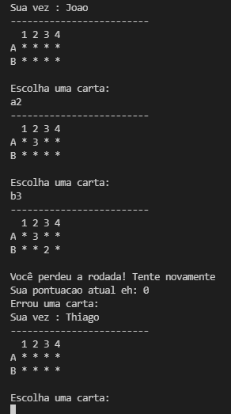

# 2022.1_G2_Funcional_ProjetoMemoria
# Projeto Memória

**Disciplina**: FGA0210 - PARADIGMAS DE PROGRAMAÇÃO - T01 <br>
**Nro do Grupo**: 02<br>
**Paradigma**: Funcional<br>

## Alunos
|Matrícula | Aluno |
| -- | -- |
| 180119818 | [Felipe Boccardi Silva Agustini](http://github.com/fealps) | 
| 180052845 | [Gabriela da Gama Pivetta](http://github.com/gabrielapivetta) | 
| 180017659 | [Giovana Vitor Dionisio Santana](http://github.com/giovanadionisio) | 
| 170011267 | [Giovanna Borges Bottino](http://github.com/giovannabbottino) | 
| 180017870 | [Giulia Lobo Barros](http://github.com/Giuulob89) | 
| 170144488 | [Henrique Amorim Costa Melo](http://github.com/henriqueamorim20) | 
| 180018574 | [Hérya Rodrigues Alcantara](http://github.com/hryds) | 
| 180025601 | [Murilo Gomes de Souza](http://github.com/murilogds)	| 

## Sobre 
Jogo da memória desenvolvido com Haskel e aplicando o paradigma funcional. Possui Funções puras, Imutabilidade, Transparência referencial e Funções de alta ordem como  filter, map e reduce.

## Screenshots
<figure>
  
  <figcaption>Menu</figcaption>
</figure><br><br>
<figure>
  
  <figcaption>Fim do Jogo</figcaption>
</figure>

## Instalação 
**Linguagens**: Haskell<br>
**Tecnologias**: Haskell, Random, Stack e GHC<br>
> Link para instalação do stack: https://docs.haskellstack.org/en/stable/install_and_upgrade/

Para rodar o Projeto do Jogo da Memória, é necessário seguir os passos abaixo:

1. Entrar na pasta correspodente ao repositório
```sh
cd 2022.1_G2_Funcional_ProjetoMemoria/src
```
2. Instalar o random
```sh
stack install random
```
3. Iniciar o GHC com o stack
```sh
stack ghci
```
4. Compilar
```sh
:load Main
```
5. Rodar Jogo
```sh
main
```

## Uso 
1. Depois que o projeto começar a rodar, irá aparecer o menu indicando as instruções para iniciar o jogo:<br><br>
<figure>
  
  <figcaption>Menu</figcaption>
</figure><br><br>
2. É possível escolher a opção **1**, a qual iniciará o jogo e mostrará novas instruções para identificação do jogador (Após o primeiro jogador ser identificado é possível inserir mais um jogador no jogo, porém essa é uma ação opcional) ou a opção **2**, a qual irá finalizar a aplicação:<br><br>
<figure>
  
  <figcaption>Identificação dos jogadores</figcaption>
</figure><br><br>
**Imagem 3**<br><br>
3. Depois que todos os jogadores são identificados, são mostrados os níveis de dificuldade do jogo: (Neste momento também é possível sair do jogo)<br><br>
<figure>
  
  <figcaption>Dificuldades</figcaption>
</figure><br><br>
4. Após escolher um nível de dificuldade o jogo, de fato, começa: (Quando há um erro, o tabuleiro volta a apresentar apenas o íncone '*', porém quando há um acerto, ele apresenta o ícone '_' )<br><br>
<figure>
  
  <figcaption>Primeira Rodada (Tabuleiro Original sem nenhum acerto)</figcaption>
</figure><br><br>
<figure>
  
  <figcaption>Rodada sem acerto</figcaption>
</figure><br><br>
<figure>
  
  <figcaption>Rodada com acerto</figcaption>
</figure><br><br>
5. Ao final do jogo, são mostradas informações como o número de pontos feitos pelo jogador vencedor e o nome dele:<br><br>
<figure>
  
  <figcaption>Fim do Jogo</figcaption>
</figure><br><br>

**Gif do fluxo completo:**<br>


## Vídeo
Adicione 1 ou mais vídeos com a execução do projeto.
Procure: 
(i) Introduzir o projeto;
(ii) Mostrar passo a passo o código, explicando-o, e deixando claro o que é de terceiros, e o que é contribuição real da equipe;
(iii) Apresentar particularidades do Paradigma, da Linguagem, e das Tecnologias, e
(iV) Apresentar lições aprendidas, contribuições, pendências, e ideias para trabalhos futuros.
OBS: TODOS DEVEM PARTICIPAR, CONFERINDO PONTOS DE VISTA.
TEMPO: +/- 15min

## Participações
Apresente, brevemente, como cada membro do grupo contribuiu para o projeto.
| Felipe Boccardi Silva Agustini | Contribuição | Significância da Contribuição para o Projeto (Excelente/Boa/Regular/Ruim/Nula) |
| Gabriela da Gama Pivetta | -- | -- |
| Giovana Vitor Dionisio Santana |  Programação dos Fatos da Base de Conhecimento Lógica | Boa |
| Giovanna Borges Bottino |  Programação dos Fatos da Base de Conhecimento Lógica | Boa |
| Giulia Lobo Barros |  Programação dos Fatos da Base de Conhecimento Lógica | Boa |
| Henrique Amorim Costa Melo |  Programação dos Fatos da Base de Conhecimento Lógica | Boa |
| Hérya Rodrigues Alcantara |  Programação dos Fatos da Base de Conhecimento Lógica | Boa |
| Murilo Gomes de Souza |  Programação dos Fatos da Base de Conhecimento Lógica | Boa |

## Outros 
Quaisquer outras informações sobre o projeto podem ser descritas aqui.
(i) Lições Aprendidas;
(ii) Percepções;
(iii) Contribuições e Fragilidades, e
(iV) Trabalhos Futuros.

## Fontes
Referencie, adequadamente, as referências utilizadas.
Indique ainda, fontes de leitura complementares.
